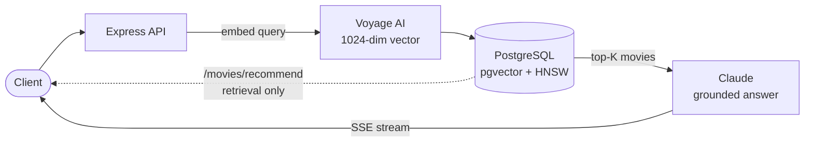

# Movie Recommender — AI RAG Application

A full AI application built around a movie catalog: multi-user document ingestion,
semantic retrieval over pgvector, grounded streamed answers with exact citations, and a
bounded tool-calling agent — plus the original semantic-search API preserved as a
working legacy sample.

[](https://github.com/FarhanYaseen/movie-recommender/actions/workflows/ci.yml)
[](https://nodejs.org/)
[](https://python.org/)
[](https://postgresql.org/)
[](LICENSE)

---

## What's in this repo

| Path | What it is |
|------|------------|
| `apps/api/` | **FastAPI AI backend** — auth (JWT), TXT/Markdown ingestion with a resumable job worker, owner-scoped pgvector retrieval, grounded SSE chat with programmatic citations, bounded agent mode (3 allowlisted tools) |
| `apps/web/` | **Next.js + TypeScript frontend** — login, document upload with live job progress, streamed cited answers, source inspection, tool-activity trail |
| `src/` | **Legacy Node/Express sample** — the original semantic search + `/ask` RAG endpoint, kept working |
| `evals/` | Retrieval evaluation: catalog golden queries (hit@k) and document fixtures with a live Recall@k/MRR runner |
| `docs/` | OpenAPI spec, frozen API contracts, implementation status, verification reports |

**The demo journey:** sign in → upload a Markdown document → watch ingestion progress →
ask a question → get a streamed answer grounded in your documents with clickable source
references → switch to agent mode and watch the model call catalog/document tools. A
second user cannot see the first user's documents, jobs, conversations, or citations
(enforced in SQL and verified by tests and live checks).

## Demo journey quick start (Docker)

```bash
cp .env.example .env   # add VOYAGE_API_KEY and ANTHROPIC_API_KEY
docker compose up -d --build
# web: http://localhost:3000 · api: http://localhost:8000
# demo logins: alice@example.com / alice-demo-password, bob@example.com / bob-demo-password
```

To also run the legacy Node sample: `docker compose --profile legacy up -d` (port 3100).

Local development without Docker is documented in `apps/api/README.md` and
`apps/web/README.md` (ports 8000 and 3000/3001, shared Postgres with pgvector).

---

## Legacy sample: semantic search API

The original project — a semantic search engine for movies. Instead of matching
keywords, it understands what you're looking for: search for "films about dreams and
reality" and it finds Inception, even though those words aren't in its description.

- **Semantic search** — meaning, not keywords, via Voyage AI embeddings
- **Vector similarity** — pgvector cosine distance with an HNSW index
- **Grounded answers** — `/ask` runs retrieval-augmented generation with Claude
- **Foundations** — health checks, graceful shutdown, OpenAPI/Swagger, Postman collection

## Quick start (legacy sample)

### Using Docker

```bash
git clone https://github.com/FarhanYaseen/movie-recommender.git
cd movie-recommender

# Add your API key
echo "VOYAGE_API_KEY=your_key" > .env

# Start the stack
docker compose up -d

# Seed the database
docker compose exec app node src/scripts/seed.js

# Test it
curl "http://localhost:3000/api/v1/movies/recommend?q=psychological+thriller"
```

### Local development

```bash
npm install
cp .env.example .env
# Edit .env with your credentials

npm run dev

# In another terminal
npm run seed
```

---

## API

### Get recommendations

```
GET /api/v1/movies/recommend?q=<query>&limit=<n>
```

Example:
```bash
curl "http://localhost:3000/api/v1/movies/recommend?q=emotional+story+about+time"
```

Response:
```json
{
  "query": "emotional story about time",
  "count": 3,
  "data": [
    {
      "id": 3,
      "title": "Interstellar",
      "genre": "Sci-Fi / Drama",
      "year": 2014,
      "director": "Christopher Nolan",
      "similarity": "0.8234"
    }
  ]
}
```

### Ask (RAG)

```
POST /api/v1/ask
```

Goes one step beyond retrieval: the top matching movies are fed to Claude as context, and it writes a grounded answer. The `sources` array is attached programmatically from the retrieval result — not generated by the model — so citations are exact by construction. If the model can't answer from the retrieved context, it says so instead of inventing.

```bash
curl -X POST "http://localhost:3000/api/v1/ask" \
  -H "Content-Type: application/json" \
  -d '{"question": "a mind-bending thriller about memory"}'
```

Response:
```json
{
  "question": "a mind-bending thriller about memory",
  "answer": "Eternal Sunshine of the Spotless Mind is the strongest match...",
  "sources": [
    { "title": "Eternal Sunshine of the Spotless Mind", "similarity": "0.8612" },
    { "title": "Inception", "similarity": "0.8471" }
  ],
  "model": "claude-opus-5-5"
}
```

#### Streaming (SSE)

Pass `"stream": true` in the POST body, or use the browser-friendly GET variant:

```bash
curl -N "http://localhost:3000/api/v1/ask?q=a+mind-bending+thriller+about+memory&stream=true"
```

Event protocol:

| Event | Payload | When |
|-------|---------|------|
| `sources` | JSON array of `{title, similarity}` | First — retrieval finishes before generation starts |
| `delta` | `{"text": "..."}` | Each text chunk from the model |
| `done` | `{"model": "..."}` | Stream complete |
| `error` | `{"message": "..."}` | On mid-stream failure, then the stream ends |

Requires `ANTHROPIC_API_KEY`; without it, `/ask` returns 503 while every other endpoint keeps working.

### Endpoints

| Method | Path | Description |
|--------|------|-------------|
| GET | `/api/v1/movies/recommend` | Semantic search |
| POST | `/api/v1/ask` | Grounded answer (RAG), JSON or SSE |
| GET | `/api/v1/ask` | Same as POST, browser-friendly SSE demo |
| GET | `/api/v1/movies` | List all movies |
| GET | `/api/v1/movies/:id` | Get single movie |
| GET | `/api/v1/health` | Health check |
| GET | `/api/v1/docs` | Swagger UI |

---

## How it works



### From semantic search to RAG

Retrieval (`/movies/recommend`) and generation (`/ask`) are two halves of the same pipeline. Retrieval embeds the query and finds the nearest movies in vector space — that alone is a useful search engine. RAG goes one step further: those retrieved movies become the context for a language model, which writes an answer grounded strictly in them. Because the model only sees movies that retrieval returned, the `sources` array can be attached from the retrieval result itself — no risk of the model citing something it never saw.

The system converts text into 1024-dimensional vectors using Voyage AI's embedding model. Similar concepts end up close together in this vector space.

```
"mind-bending sci-fi" → [0.12, -0.87, 0.34, ...]
```

When you search, your query gets converted to a vector too. PostgreSQL with pgvector then finds the movies with the smallest cosine distance to your query — that's your recommendation list.

```sql
SELECT title, 1 - (embedding <=> query_vector) AS similarity
FROM movies
ORDER BY embedding <=> query_vector
LIMIT 5;
```

The `<=>` operator calculates cosine distance. Lower distance means higher similarity.

---

## Project structure

```
src/
├── config/           # Environment and database setup
├── middleware/       # Error handling, request logging
├── routes/           # API endpoints
├── services/         # Business logic, embedding + Claude calls
└── scripts/          # Database seeding

evals/
├── golden-queries.json   # Golden retrieval queries with expected titles
└── run-evals.js          # hit@k evaluation harness

tests/
└── api.test.js       # API tests with mocked providers

docs/
├── openapi.yaml      # API specification
└── postman_collection.json

public/
└── index.html        # Demo frontend
```

---

## Evaluation

```bash
npm run evals
```

Retrieval quality is measured against golden queries: natural-language searches with known correct answers from the catalog (`evals/golden-queries.json`). For each query the harness checks **hit@k** — whether an expected title appears in the top k results. hit@1 means the best match came first; hit@5 means it at least made the list. The run fails (non-zero exit) if hit@5 drops below 0.8, so it can gate CI.

Current scores on the seed catalog:

```
[evals] hit@1: 1.00  hit@3: 1.00  hit@5: 1.00  mean top similarity: 0.6159  (15 queries)
[evals] PASS: hit@5 1.00 >= threshold 0.8
```

### Document retrieval (AI backend)

The document pipeline has its own labeled set: 12 in-scope questions over synthetic
fixture documents (provenance recorded in `evals/doc-golden-queries.json`) plus 3
out-of-scope questions. The opt-in live runner (`RUN_LIVE_EVALS=true python3
evals/run-doc-evals.py`) uploads the fixtures, waits for ingestion, and measures
document-level ranking through the real `/api/search` endpoint.

Live results (2026-10-08, full report in `docs/verification/doc-retrieval-report.json`):

```
[doc-evals] Recall@1: 0.92  Recall@4: 1.00  MRR: 0.958  (12 in-scope queries)
[doc-evals] Out-of-scope top scores: 0.178, 0.129, 0.235
```

Out-of-scope questions score well below in-scope ones (≤0.24 vs mostly ≥0.5), which is
the separation the chat endpoint's insufficient-evidence floor relies on.

---

## Testing

```bash
npm test
```

Tests run without network access, a database, or API keys: the embedding service, the database pool, and the Anthropic client are all mocked. They cover validation errors, the 503 degradation when `ANTHROPIC_API_KEY` is unset, and the happy paths for `/movies/recommend` and `/ask`.

---

## Configuration

| Variable | Description | Default |
|----------|-------------|---------|
| PORT | Server port | 3000 |
| NODE_ENV | Environment | development |
| VOYAGE_API_KEY | Voyage AI key | required |
| ANTHROPIC_API_KEY | Anthropic key (for `/ask`) | optional — `/ask` returns 503 without it |
| ANTHROPIC_MODEL | Claude model for `/ask` | claude-opus-5-5 |
| DB_HOST | PostgreSQL host | localhost |
| DB_PORT | PostgreSQL port | 5432 |
| DB_NAME | Database name | movie_recommender |
| DB_USER | Database user | postgres |
| DB_PASSWORD | Database password | required |

---

## Deployment

```bash
docker compose up -d --build
docker compose logs -f app
```

For production, set `NODE_ENV=production` and use strong passwords.

---

## Performance

Embedding dimensions are 1024 (`voyage-3`). End-to-end query latency is dominated by the
embedding API call. No benchmarked latency figures are published for this repo; the
opt-in eval runner (`evals/run-doc-evals.py`) records client-measured per-query
wall-clock times with its reports, with the measurement definition stated alongside.

---

## Limitations and deferred work

Implemented and verified here: everything in "What's in this repo", backed by the test
suites and `docs/verification/`. Known limitations of this delivery:

- **Live answer generation requires an Anthropic API key with credits.** With a funded
  key, all generation paths (`/ask`, RAG chat, agent mode) are verified live end to end
  (see `docs/verification/final-report.md`); with an unfunded key they fail safely
  (`error` + `done(failed)` events) while retrieval, ingestion, auth, and isolation
  keep working.
- The ingestion worker and embedding rate limiter are single-process (fine for the local
  demo; not a distributed quota guarantee).
- Auth uses expiring access tokens without refresh tokens; the web app keeps the token
  in memory + sessionStorage (trade-off documented in `apps/web/README.md`).
- TXT/Markdown ingestion only (PDF/OCR deferred). One embedding model per deployment;
  changing models requires a reindex migration.
- Deferred by scope: MCP, multi-agent orchestration, additional vector stores,
  Kubernetes, fine-tuning.

---

## License

MIT — see [LICENSE](LICENSE)

---

## Author

**Farhan Yaseen**
[Portfolio](https://farhanyaseen.netlify.app/) · [LinkedIn](https://linkedin.com/in/Farhanyaseen) · farhan.yaseen.se@gmail.com

---

## Looking for similar work?

I build recommendation systems, semantic search, and AI-powered APIs. If you need help with vector databases (pgvector, Pinecone, Weaviate) or embedding integrations, get in touch.
